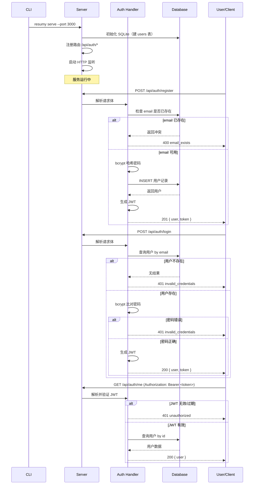

# backend-scaffold-auth

## 0. 术语约定

| 术语 | 定义 | 防冲突结论 |
|---|---|---|
| serve 命令 | `resumy serve` — 启动 Web 服务的 CLI 子命令 | 无冲突，现有命令只有 `generate` 和 `templates` |
| JWT | JSON Web Token，用于 API 请求认证 | 无冲突，项目未涉及 |
| bcrypt | 密码哈希算法 | 无冲突 |
| SQLite | 嵌入式数据库，用于存储用户数据 | 无冲突，项目目前无数据库依赖 |

## 1. 决策与约束

### 需求摘要

**做什么**：为 resumy CLI 新增 `resumy serve` 命令，启动一个 HTTP Web 服务器，提供用户注册/登录/身份认证 API，使用 SQLite 持久化用户数据。

**为谁**：未来 Web App 的前端开发者（本次不涉及前端，仅提供 API）。

**成功标准**：
- 运行 `resumy serve` 后在本机端口启动 HTTP 服务
- `POST /api/auth/register` 创建用户并返回 JWT
- `POST /api/auth/login` 验证凭证并返回 JWT
- `GET /api/auth/me` 通过 JWT 获取当前用户信息
- 以上 API 数据持久化到 SQLite 文件

**明确不做**：
- 不提供前端 UI（归 `user-auth-frontend`）
- 不涉及简历 CRUD（归 `resume-crud-api`）
- 不提供 HTTPS/SSL 配置（开发阶段仅 HTTP）
- 不提供邮箱验证/密码重置
- 不提供角色/权限系统
- 不提供数据库迁移工具（SQLite 自动建表）

### 复杂度档位

走"内部后端服务"默认档位，无偏离。

### 关键决策

1. **HTTP 框架：Bun 内置 `Bun.serve`** — 零依赖，Bun 原生 HTTP server 性能好，API 简洁，符合项目"Bun-first"原则
2. **数据库：SQLite（`bun:sqlite`）** — 零依赖、零配置、嵌入式，开发阶段最轻量；同仓库的 "Bun-first" 路线一致
3. **认证方案：JWT（`jsonwebtoken` npm 包）** — 无状态认证，适合前后端分离；密钥从环境变量或启动参数读取
4. **密码哈希：bcrypt（`bcryptjs` npm 包）** — 标准密码哈希，纯 JS 实现无原生编译依赖

### 前置依赖

无。这是 roadmap 第一条 feature，无前置依赖。

## 2. 名词与编排

### 2.1 名词层

#### 现状
无现状，全新。项目目前没有 Web 服务、用户系统、数据库相关的代码。

#### 变化

**新增类型：请求体 DTO**

```
// 来源：src/web/auth/handlers.ts（新增）

interface RegisterRequest {
  email: string;
  password: string;
  name: string;
}

interface LoginRequest {
  email: string;
  password: string;
}

interface UserResponse {
  id: string;
  email: string;
  name: string;
}

interface AuthResponse {
  user: UserResponse;
  token: string;
}
```

**新增类型：数据库实体**

```
// 来源：src/web/db/schema.ts（新增）

interface UserRow {
  id: string;             // UUID
  email: string;          // UNIQUE
  password_hash: string;  // bcrypt hash
  name: string;
  created_at: string;     // ISO8601
}
```

**新增类型：HTTP 错误响应**

```
// 来源：src/web/server.ts（新增）

interface ErrorResponse {
  error: string;
  message: string;
}
```

**接口契约（遵循 roadmap 定义）**：

```
POST /api/auth/register
Request:  { email: string, password: string, name: string }
Response: 201 { user: { id, email, name }, token: string }
错误：    400 { error: "email_exists", message: "..." }
          400 { error: "invalid_input", message: "..." }

POST /api/auth/login
Request:  { email: string, password: string }
Response: 200 { user: { id, email, name }, token: string }
错误：    401 { error: "invalid_credentials", message: "..." }

GET /api/auth/me
Headers:  Authorization: Bearer <token>
Response: 200 { user: { id, email, name } }
错误：    401 { error: "unauthorized", message: "..." }
```

**新增 CLI 命令选项**：

```
// 来源：src/cli/commands/serve.ts（新增）

Usage: resumy serve [options]

Options:
  --port        HTTP 端口号（默认 3000，环境变量 PORT）
  --host        监听地址（默认 "0.0.0.0"，环境变量 HOST）
  --db          数据库文件路径（默认 "./resumy.db"，环境变量 RESUMY_DB）
  --jwt-secret  JWT 签名密钥（默认自动生成，环境变量 RESUMY_JWT_SECRET）
```

所有配置项同时支持同名环境变量，CLI flag 优先级高于环境变量。此设计便于 Docker 部署时通过 `-e` 传参。

### 2.2 编排层

#### 主流程图



#### 现状
无现状，全新编排。

#### 变化
新增完整的新编排链路，分为三部分：
1. **服务启动流**：CLI 解析 `serve` 参数 → 初始化数据库 → 注册路由 → 启动 HTTP 监听
2. **认证请求流**（register / login / me）：请求 → 路由分发 → handler 处理 → 数据库交互 → 响应
3. **JWT 中间件流**：请求 → 提取 Authorization 头 → 验证 JWT → 注入用户信息 → handler 执行

#### 流程级约束
- **错误语义**：所有错误响应统一格式 `{ error: string, message: string }`；HTTP 4xx 不重试，5xx 返回 500
- **幂等性**：`POST /api/auth/register` 不幂等（重复请求返回 email_exists）；`POST /api/auth/login` 幂等（同一凭证返回相同结果）；`GET /api/auth/me` 幂等
- **并发**：SQLite 写操作顺序执行（bun:sqlite 默认串行化），无需额外锁
- **JWT 过期时间**：7 天
- **可观测**：启动日志（端口、数据库路径）、请求日志（method、path、status、耗时）

### 2.3 挂载点清单

| 挂载位置 | 文件 | 动作 |
|---|---|---|
| CLI 命令注册 | `src/cli/commands/serve.ts`（新增）→ `src/cli/index.ts` registerServeCommand 调用 | 新增 |
| HTTP 路由注册 | `src/web/server.ts`（新增）`router.post("/api/auth/register", ...)` | 新增 |
| 数据库初始化 | `src/web/db/schema.ts`（新增）`CREATE TABLE IF NOT EXISTS users(...)` | 新增 |
| JWT 密钥配置 | `src/web/server.ts`（新增）`--jwt-secret` CLI flag | 新增 |

### 2.4 推进策略

```
1. 编排骨架：注册 `serve` 命令 + 空 HTTP 服务器启动 + 关闭
   退出信号：`resumy serve --port 3000` 启动后 `curl localhost:3000` 返回响应

2. 数据库层：SQLite 初始化 + users 表自动建表 + 用户 CRUD 函数
   退出信号：数据库文件创建 + 插入一条用户数据可查询

3. Auth 计算节点：register + login + me handler 实现
   退出信号：注册 → 登录 → 获取用户信息三合一 curl 测试通过

4. JWT 中间件：Authorization 头提取 + 验证 + 注入
   退出信号：无 token 请求 401，有效 token 可正常访问 /me

5. 测试覆盖：补齐关键场景清单
   退出信号：所有验收场景都有可观察证据
```

### 2.5 结构健康度与微重构

##### 评估
- 文件级 — 本次 feature 不修改现有文件（只新增），不做评估
- 目录级 — `src/web/` 为全新目录，本次创建 `src/web/auth/`、`src/web/db/`、`src/web/server.ts`，目录无摊平问题

##### 结论：不做

本次 feature 全部为新增文件，不修改现有代码，无微重构必要。

## 3. 验收契约

### 关键场景清单

**正常路径：**

1. 启动服务：`resumy serve --port 3099 --db ./test.db` → 日志输出 "Server running on http://0.0.0.0:3099"，`curl http://localhost:3099/api/auth/register` 可访问
2. 注册成功：`POST /api/auth/register { email: "a@b.com", password: "123456", name: "Test" }` → `201 { user: { id, email: "a@b.com", name: "Test" }, token }`
3. 登录成功：`POST /api/auth/login { email: "a@b.com", password: "123456" }` → `200 { user: { id, email: "a@b.com", name: "Test" }, token }`
4. 获取用户信息：`GET /api/auth/me` 带 token → `200 { user: { id, email, name } }`

**边界路径：**

5. 重复注册：同一 email 注册两次 → 第二次返回 `400 { error: "email_exists" }`
6. 密码错误：正确 email + 错误密码 → `401 { error: "invalid_credentials" }`
7. 不存在的 email：不存在的 email 登录 → `401 { error: "invalid_credentials" }`

**错误路径：**

8. 无 token 访问 /me：`GET /api/auth/me` 无 Authorization 头 → `401 { error: "unauthorized" }`
9. 无效 token：`GET /api/auth/me` 带无效 JWT → `401 { error: "unauthorized" }`
10. 注册参数缺失：`POST /api/auth/register {}` → `400 { error: "invalid_input" }`

### 明确不做的反向核对项

- 代码中不应包含前端 HTML/CSS/JS 文件
- 代码中不应包含简历 CRUD 相关路由
- 不应引入 PostgreSQL/MySQL 等外部数据库依赖（仅 SQLite）

## 4. 与项目级架构文档的关系

本次 feature 引入的全新模块 `src/web/` 和 `src/cli/commands/serve.ts` 应在验收通过后更新入 `ARCHITECTURE.md`：

- **名词**：新增"Web Server Module"模块描述（`src/web/`），包含 Auth API 对外契约
- **动词骨架**：新增 CLI 命令 `serve` 和 REST API 路由表
- **流程级约束**：JWT 认证方式、SQLite 持久化约定、统一错误响应格式

建议验收后在 `ARCHITECTURE.md` 的"子系统/模块索引"节追加 `src/web/` 条目，在"核心概念"节追加 JWT Token/SQLite 等术语。
