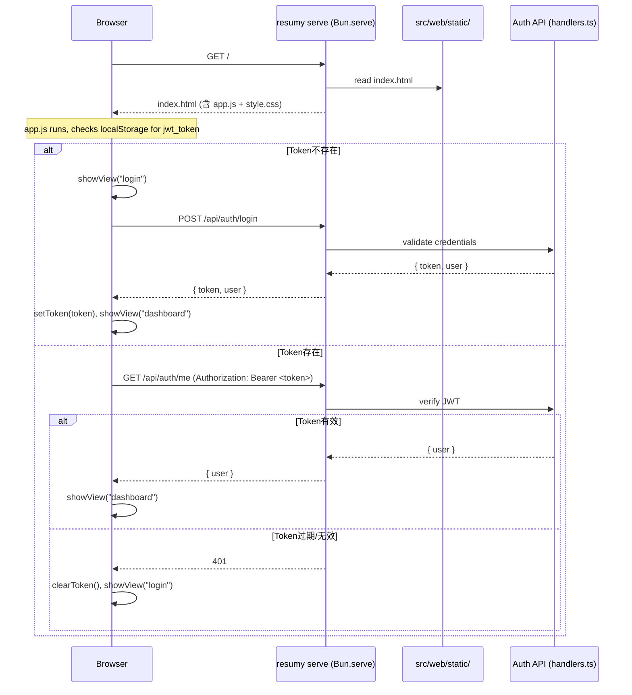

## 0. 术语约定

| 术语 | 定义 | 防冲突结论 |
|---|---|---|
| SPA | Single Page Application，单页应用，登录/注册/仪表盘在同一 HTML 内通过 JS 切换视图 | 新建概念，无冲突 |
| JWT | JSON Web Token，客户端存 localStorage，通过 Authorization header 传递 | 已在 auth handlers 中使用 |
| Auth API | 已有的 `POST /api/auth/register` / `POST /api/auth/login` / `GET /api/auth/me` | 已在 `src/web/auth/handlers.ts` 中实现 |
| Dashboard | 登录后的首页，显示用户信息 + 登出按钮（后续 feature 扩展为简历管理页面） | 新建概念，无冲突 |

概念均已 grep 确认与现有代码无冲突。

## 1. 决策与约束

### 需求摘要

- **做什么**：为 `resumy serve` 添加前端登录/注册页面和静态文件服务，用户可通过浏览器完成注册、登录、登出。
- **为谁**：非 CLI 用户，首次打开 `http://localhost:3000` 就能用的 Web 界面。
- **成功标准**：
  - 浏览器打开 `http://localhost:3000` → 看到登录页面
  - 用户可注册新账号 → 自动登录 → 跳转到仪表盘
  - 已注册用户可登录 → 跳转到仪表盘
  - 仪表盘显示用户姓名 + 登出按钮 → 登出后回到登录页
  - 未登录用户访问受保护页（仪表盘）被重定向到登录页
- **明确不做**：
  - 不引入前端框架 / 构建工具（原生 HTML/CSS/JS）
  - 不做密码找回/重置
  - 不做第三方 OAuth 登录
  - 不做任何简历 CRUD 操作（后续 feature 覆盖）
  - 不做响应式适配（登录/注册页面仅确保桌面可用）

### 复杂度档位

走 "Web 前端 SPA 轻量" 默认档位，无偏离。

### 关键决策

1. **前端技术栈 = 原生 HTML/CSS/JS**。
   - 动机：零构建、零前端依赖、不引入打包工具、Bun 直接 serve 静态文本即可。登录/注册/仪表盘三视图逻辑简单，原生 DOM 操作足够。
   - 被拒方案：React/Vue/Svelte + Vite → 引入构建步骤，对本 feature 的简单页面而言过重。

2. **SPA 方案**。
   - 动机：添加页面时不重启服务器，后续 resume-form-editor 等页面可无缝追加。
   - 所有视图在同一个 `index.html` 中通过 `display: none` / `block` 切换。

3. **静态文件方式**。
   - `index.html` + `app.js` + `style.css` 放在 `src/web/static/`。
   - server.ts 新增 `GET /` → 返回 `index.html`，`GET /static/*` → 返回对应文件。
   - 不做缓存指纹，不做文件合并。

4. **Token 存储**：`localStorage`（`jwt_token` key）。简单、SPA 场景适用。

### 前置依赖

- `backend-scaffold-auth` 已完成（依赖满足 ✓）
- 需要 server.ts 已有 JWT 验证 + `/api/auth/*` 路由（已存在 ✓）

## 2. 名词与编排

### 2.1 名词层

#### 现状

当前无任何前端文件。Auth API 已就绪：

- `src/web/auth/handlers.ts` — register / login / me 三个 handler
- `src/web/server.ts` — `Bun.serve` + 路由分发，仅处理 `/api/auth/*`

#### 变化

新增 4 个文件：

| 文件 | 职责 | 动作 |
|---|---|---|
| `src/web/static/index.html` | SPA 容器，包含三个 `<div id="view-*">` 视图（login / register / dashboard） | 新增 |
| `src/web/static/app.js` | 客户端路由、API fetch、DOM 操作、JWT 管理 | 新增 |
| `src/web/static/style.css` | 全局样式（配色、布局、表单、按钮） | 新增 |
| `src/web/static/spa-utils.js` | 共享 DOM 工具函数：`$()`, `showView()`, `apiFetch()`, `getToken()`, `setToken()` | 新增 |

修改 1 个已有文件：

| 文件 | 职责 | 动作 |
|---|---|---|
| `src/web/server.ts` | HTTP 路由分发 | 修改：新增 `GET /` → index.html, `GET /static/*` → 文件服务 |

#### 接口示例

**静态文件路由**（server.ts 新增）

```
// 来源：src/web/server.ts — 新增 static file handling
// 入口处的 `handleStaticRoute`
GET / → Response(200, index.html, Content-Type: text/html)
GET /static/app.js → Response(200, <file content>, Content-Type: application/javascript)
GET /static/style.css → Response(200, <file content>, Content-Type: text/css)
GET /static/spa-utils.js → Response(200, <file content>, Content-Type: application/javascript)
GET /nonexistent → 由现有路由 fallthrough 返回 404
```

**客户端 API 封装**（app.js / spa-utils.js）

```
// 来源：src/web/static/spa-utils.js apiFetch()
// 封装 fetch，自动带 Authorization header
apiFetch("/api/auth/me") → GET, Authorization: Bearer <token>
apiFetch("/api/auth/register", { email, password, name }) → POST with JSON body
apiFetch("/api/auth/login", { email, password }) → POST with JSON body
```

**视图切换模型**

```
// 来源：src/web/static/spa-utils.js showView()
showView("login")   → #view-login display: block, others display: none
showView("register")→ #view-register display: block, others display: none
showView("dashboard")→ #view-dashboard display: block, others display: none
```

### 2.2 编排层

#### 主流程图



#### 现状

`src/web/server.ts` 目前的 fetch handler 走 `handleAuthRoute()` → 匹配则响应，否则 404。所有文件不涉及静态资源。

#### 变化

1. **server.ts 编排变化**：`fetch()` 函数处理流程变为：
   - 尝试 `handleAuthRoute()`（API 路由优先）
   - 尝试 `handleStaticRoute()` — `GET /` → index.html, `GET /static/*` → 文件
   - 以上都不匹配 → 404

2. **客户端控制流**：
   - 页面加载 → `app.js` 的 `init()` 检查 JWT
   - JWT 有效 → 调用 `/api/auth/me` 验证 → show dashboard
   - JWT 无效/不存在 → show login
   - login 表单提交 → POST `/api/auth/login` → 成功存 JWT → dashboard
   - register 表单提交 → POST `/api/auth/register` → 成功存 JWT → dashboard
   - dashboard 登出按钮 → clear JWT → 回到 login

#### 流程级约束

- 错误语义：API 返回错误（400/401）→ 在页面顶部显示红色错误消息，不清除表单
- 幂等性：login/register 提交按钮在提交后 disabled，防止重复提交
- 顺序约束：`app.js` 必须等 DOMContentLoaded 后执行 `init()`
- 可观测点：JS fetch 错误打印到 console.error

### 2.3 挂载点清单

| 挂载位置 | 文件 | 动作 |
|---|---|---|
| HTTP 路由表 — `GET /` | `src/web/server.ts` | 新增 — serve index.html |
| HTTP 路由表 — `GET /static/*` | `src/web/server.ts` | 新增 — serve static files |
| 客户端 localStorage — `jwt_token` key | 浏览器 | 新增 — 存 JWT 令牌 |

> 以上 3 项任意一项被移除，用户就无法通过浏览器完成登录/注册。

### 2.4 推进策略

1. **静态文件服务**：server.ts 添加 `handleStaticRoute()`，读取 `src/web/static/` 下的文件并响应
   - 退出信号：浏览器访问 `http://localhost:3000/` 返回 index.html 内容
2. **SPA 骨架 + login 视图**：index.html 三视图占位 + app.js init() 检查 token → 显示 login
   - 退出信号：打开页面看到登录表单，可输入并提交
3. **Register 视图**：注册表单 + 提交逻辑
   - 退出信号：填写 email/password/name → 注册成功 → 自动登录 → dashboard
4. **Dashboard + logout**：显示用户名称 + 退出按钮
   - 退出信号：登录后看到"你好，{name}" + 登出按钮 → 点击后回到 login
5. **样式打磨**：style.css 美化，全局配色，表单聚焦、错误提示
   - 退出信号：页面视觉基本可用，与 CLI 风格协调

### 2.5 结构健康度与微重构

#### 评估

- **文件级** — `src/web/server.ts`（约 59 行，职责单一：HTTP 服务 + 路由分发）
  - 行数：59 行，不超
  - 职责：当前只有 auth 路由，结构清理，路由按 `handleAuthRoute` 函数隔离
  - 改动密度：仅新增一个 `handleStaticRoute` 分支 + 在 fetch 中插入调用
- **目录级** — `src/web/`（现有 4 文件：server.ts + auth/ + db/）
  - 现有文件数：4（含子目录），不拥挤
  - 本次将新增 `static/` 子目录（含 4 个文件），新建子目录路径 `static/` 清晰
- **compound 查询**：无可用的 compound convention

#### 结论：不做微重构

server.ts 当前结构健康，新增 `handleStaticRoute` 函数不会导致职责混杂。`src/web/static/` 作为新子目录，命名清晰。

## 3. 验收契约

### 关键场景清单

| # | 场景 | 触发 | 期望结果 |
|---|---|---|---|
| 1 | 首次访问 | 浏览器打开 `http://localhost:3000` | 看到登录页面（email + password 表单 + "没有账号？注册"链接） |
| 2 | 用户注册 | 填写 email/password/name → 点击注册 | 201 → JWT 存入 localStorage → 自动跳转仪表盘 |
| 3 | 已注册用户登录 | 填写 email/password → 点击登录 | 200 → JWT 存入 localStorage → 跳转仪表盘 |
| 4 | 仪表盘显示 | 登录/注册成功后 | 显示 "你好，{name}" + 登出按钮 |
| 5 | 登出 | 点击登出按钮 | localStorage 清除 JWT → 回到登录页 |
| 6 | 已登录用户刷新 | 登录后 F5 刷新页面 | JWT 有效 → 直接显示仪表盘（跳过登录页） |
| 7 | token 过期 | 修改 localStorage 的 token 为过期值 → 刷新 | 401 → 清除 token → 显示登录页 |
| 8 | 注册已存在邮箱 | 用已有邮箱注册 | 400 email_exists → 显示红色错误消息，不清除表单 |
| 9 | 登录错误凭据 | 输入错误密码 | 401 invalid_credentials → 显示红色错误消息 |
| 10 | 登录页切到注册 | 点击"没有账号？注册"链接 | 切换到注册表单 |
| 11 | 注册页切到登录 | 点击"已有账号？登录"链接 | 切换到登录表单 |

### 明确不做的反向核对

- 页面加载后 DOM 中不应出现 `<script src="https://...">` 等外部 CDN 引用
- 不应出现 `npm` 或前端工程的 `package.json` 或 `vite.config.*` 等构建配置文件
- 登出后不应在 localStorage 残留 `jwt_token`

## 4. 与项目级架构文档的关系

### 需提炼回 ARCHITECTURE.md

- **名词**：`src/web/static/` — 前端 SPA 静态资源目录
- **动词骨架**：静态文件服务流程 — `GET /` → index.html, `GET /static/*` → 文件
- **流程级约束**：API 路由优先于静态路由

### 关联架构 doc

- 已关联 `src/web/` 模块（ARCHITECTURE.md 第 3 节）

本 feature 改动局限在 `src/web/` 模块内部。
