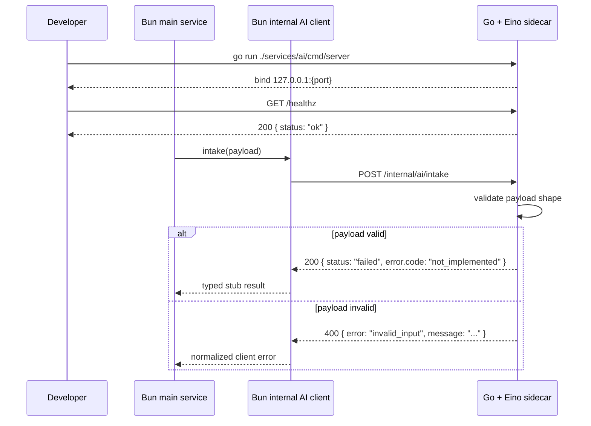

## 0. 术语约定

| 术语 | 定义 | 防冲突结论 |
|---|---|---|
| AI sidecar service | 与 Bun 主服务并列运行的独立进程，负责 AI workflow / agent 编排，不直接接管用户流量 | 仓库内全新概念；与现有 `src/web/server.ts` 单进程结构不冲突 |
| AI Orchestration Service | roadmap 中定义的 AI 编排模块，本 feature 的具体落点是 `services/ai/` Go 服务 | 名称来源 `.codestable/roadmap/ai-resume-agent/ai-resume-agent-roadmap.md` 第 3 节 |
| Internal AI API | Bun 主服务调用 AI sidecar 的内部 HTTP 接口，不暴露给浏览器 | 名称来源 roadmap 第 4.3 节；当前代码里尚无实现 |
| Stub workflow | 先返回稳定的 `not_implemented` 结构化结果的占位 workflow，用来验证进程、路由、请求/响应契约和错误语义 | 新建概念，无冲突 |

已对 `Eino`、`internal/ai`、`AI Orchestration Service`、`ai_jobs`、`AI Resume Agent` 做 grep；当前仅 roadmap 文档出现，没有现有代码概念冲突。

## 1. 决策与约束

### 需求摘要

- **做什么**：在现有 Bun 仓库中新增一个 Go + Eino sidecar service 骨架，提供可启动的独立进程、healthcheck、Internal AI API stub endpoint，以及 Bun 侧的最小内部客户端封装。
- **为谁**：后续 `ai-job-api`、`ai-document-intake`、`ai-resume-structuring` 等 feature 的实现者；他们需要一个已定边界、已定协议、可本地运行的 AI 服务底座，而不是继续把 AI 逻辑塞进 Bun 主服务。
- **成功标准**：
  - 仓库新增 `services/ai/`，可以单独 `go run` 启动 AI service
  - `GET /healthz` 返回 200，证明 sidecar 可被本地探活
  - `POST /internal/ai/intake` 和 `POST /internal/ai/continue` 已按 roadmap 协议占位，实现结构化 stub 响应
  - Bun 侧已有类型化内部客户端，可向 AI service 发请求并统一处理响应/错误
  - 该 feature 完成后，后续 feature 不需要再讨论“AI service 放哪、怎么起、协议长什么样”
- **明确不做**：
  - 不实现真正的模型调用、prompt 编排或 ResumeDocument 结构化生成
  - 不实现浏览器端 AI 入口、AI job 存储表、权限路由或对外 API
  - 不让 AI service 直接连接主数据库
  - 不在本 feature 内把 Bun 主服务改成多进程 supervisor
  - 不替换现有 `src/web/server.ts`、CLI 入口或 PDF 生成链路

### 复杂度档位

- `健壮性 = L3`（偏离默认 L2 的原因：这是跨 runtime 的内部 HTTP 边界，输入校验、错误语义和失败回包必须先收紧，否则后续 feature 会在不稳定契约上叠逻辑）
- `结构 = modules`（偏离默认 functions 的原因：新增独立 Go 服务目录 + Bun 侧内部客户端，天然是跨模块组织）
- `安全性 = validated`（偏离默认 trusted 的原因：虽然是内部服务，但依然接收外部进程传入的 payload，需要基本输入校验与最小暴露）

其余维度走“项目内部工具”默认档位，无偏离。

### 关键决策

1. **AI 服务以 sidecar 独立进程落在 `services/ai/`，不塞回 `src/web/`。**
   - 动机：现有仓库主 runtime 是 Bun；Eino 更适合作为独立 Go 进程。把 Go runtime 混进 Bun 进程不可行，把 AI workflow 继续塞进 TypeScript 会让后续 Eino 方向失真。
   - 被拒方案：
     - 直接在 Bun 中实现 AI orchestration → 背离 roadmap 的 Eino 方向
     - 直接把整个仓库迁到 Go → 超出本 roadmap 一期边界，且会丢失现有模板 / Web / PDF 内核

2. **Internal AI API 先落最小稳定骨架，返回确定性的 stub 结果，而不是假装实现 AI。**
   - 动机：本 feature 的职责是定边界和跑通进程，不是交付“看起来能用但语义不稳定”的假 AI。
   - 具体策略：合法请求返回 `status: "failed"` + `error.code: "not_implemented"` 的结构化结果；非法请求返回 400 `invalid_input`。

3. **Bun 侧同步建立类型化内部客户端，但不接入用户流量。**
   - 动机：如果只起 Go 服务、不在 Bun 侧留下调用抽象，后续 `ai-job-api` 还得重复定义 URL、超时、错误解析。
   - 被拒方案：等 `ai-job-api` 再加客户端 → 会导致本 feature 无法验证“打通 Bun -> AI service 内部调用”。

4. **AI service 默认只监听回环地址。**
   - 动机：这是 sidecar internal service，不应该默认暴露到外网。
   - 具体约束：默认 `127.0.0.1`，端口独立配置；后续需要容器化或跨主机通信时再通过 roadmap / feature 明确升级。

### 前置依赖

- `ai-resume-agent` roadmap 条目 `eino-service-scaffold` 依赖为空，启动条件满足
- 现有仓库没有 `services/` 目录、没有 AI service、没有 Bun 侧 internal AI client，这是本 feature 的直接输入现状

## 2. 名词与编排

### 2.1 名词层

#### 现状

- 仓库当前只有 Bun/TypeScript runtime：`index.ts` 进入 `src/cli/index.ts`，`resumy serve` 由 `src/web/server.ts` 启动单个 `Bun.serve` 进程。
- `package.json` 只有 Bun / Node 相关脚本，没有 Go service 运行入口，也没有多服务本地开发约定。
- roadmap 已经定义了 Internal AI API 契约（`.codestable/roadmap/ai-resume-agent/ai-resume-agent-roadmap.md` 第 4.3 节），但代码里没有对应目录、没有服务、没有客户端。

#### 变化

新增 3 组名词：

| 名词 | 动作 | 变化 |
|---|---|---|
| `services/ai/` | 新增 | Go module 级别的 AI sidecar service 根目录，承载 cmd / internal / config |
| Internal AI API envelope | 新增 | Go service 和 Bun client 共享的请求/响应结构，先覆盖 `intake` / `continue` 两个 stub endpoint |
| Bun internal AI client | 新增 | Bun 侧统一调用 AI service 的最小封装，负责 base URL、timeout、响应解析、错误映射 |

修改 1 处现有名词：

| 名词 | 动作 | 变化 |
|---|---|---|
| 根运行约定 | 修改 | 仓库从“单 Bun runtime”扩展为“Bun 主服务 + 可选独立 Go sidecar”，但对浏览器主入口无变化 |
| 根级 Go workspace 契约 | 新增 | 通过仓库根 `go.work` 让 `go run ./services/ai/cmd/server` 这种从仓库根发起的运行方式成立 |

#### 接口示例

**AI service healthcheck**

```text
# 来源：services/ai/cmd/server main + internal/http server
GET /healthz
Response: 200 { "status": "ok" }
```

**Internal AI API stub：intake**

```json
// 来源：services/ai/internal/httpapi/intake handler
POST /internal/ai/intake
Request:
{
  "job_id": "job_123",
  "source": { "type": "text", "text": "candidate raw text" },
  "mode": "import",
  "context": {}
}

Response:
{
  "status": "failed",
  "error": {
    "code": "not_implemented",
    "message": "AI workflow scaffold is running but intake logic is not implemented yet"
  }
}
```

**Bun internal client**

```typescript
// 来源：src/web/ai/client.ts（新文件）
await aiClient.intake({
  job_id: "job_123",
  source: { type: "text", text: "candidate raw text" },
  mode: "import",
  context: {},
})

// 返回：
// { status: "failed", error: { code: "not_implemented", message: "..." } }
```

### 2.2 编排层

#### 主流程图



#### 现状

- 当前主流程只有 Bun 单进程：浏览器或 CLI 直接命中 `src/web/server.ts` 或 CLI 命令，不存在跨进程 AI 调用。
- 现有 `src/web/server.ts` 内部所有能力都通过直接 import 本地模块完成，如 `resumeRoutes`、`pdfRoutes`、`importRoutes`。
- 仓库当前没有“外部服务依赖 -> 本地 typed client -> 统一错误语义”这层编排骨架。

#### 变化

1. **运行拓扑变化**：新增一个独立 Go 进程，但不改变 Bun 的主入口；本 feature 后仓库从单 runtime 变成双 runtime。
2. **请求拓扑变化**：Bun 侧首次引入“typed internal client -> internal HTTP service”的调用链，但该链路只用于开发级 smoke / 后续 feature 复用，不挂进用户 API。
3. **AI service 内部流程**：
   - 启动配置解析
   - 路由注册（`/healthz`、`/internal/ai/intake`、`/internal/ai/continue`）
   - payload 校验
   - 返回结构化 stub 结果

#### 流程级约束

- **错误语义**：
  - payload 不合法 -> HTTP 400 `invalid_input`
  - endpoint 已存在但 workflow 未实现 -> HTTP 200 + `status: "failed"` + `error.code: "not_implemented"`
- **幂等性**：stub endpoint 不做持久化、副作用、重试写操作，请求是读式占位行为
- **顺序约束**：后续 Bun 用户流量接入前，必须先有本 feature 提供的 base URL、超时和响应 envelope 抽象
- **安全约束**：AI service 默认仅监听回环地址，不做公网暴露
- **可观测点**：
  - Go sidecar 对每个请求打印基础结构化日志（path、status、latency、error_code）
  - Bun internal client 对 timeout / non-2xx / envelope parse 失败做统一错误类型封装

### 2.3 挂载点清单

| 挂载位置 | 具体位置 | 动作 |
|---|---|---|
| 新运行时根目录 | `services/ai/` | 新增 — Go + Eino sidecar service 根目录 |
| 根脚本入口 | `package.json` scripts | 新增 — AI service 本地运行 / smoke 相关脚本 |
| Bun 内部 AI client 挂入点 | `src/web/ai/client.ts` | 新增 — 主服务内部统一调用 AI service 的封装 |
| Internal AI API 路由表 | `services/ai/` HTTP server | 新增 — `/healthz`、`/internal/ai/intake`、`/internal/ai/continue` |

删除以上任一项，这个 feature 就不成立：要么没有 sidecar 目录，要么没有运行入口，要么没有 Bun 侧调用封装，要么没有 internal route。

### 2.4 推进策略

1. **Sidecar 骨架**：建立 `services/ai/` Go module、启动入口和基础配置解析
   - 退出信号：本地 `go run` 可启动服务并打印监听地址
2. **Internal route 骨架**：挂上 `/healthz`、`/internal/ai/intake`、`/internal/ai/continue`
   - 退出信号：3 个 endpoint 均可访问；`/healthz` 返回 200
3. **Stub 语义与输入校验**：为两个 internal AI endpoint 补齐最小 payload 校验和 `not_implemented` 结构化响应
   - 退出信号：合法请求返回稳定 stub envelope；非法请求返回 400 `invalid_input`
4. **Bun internal client**：新增 typed client，统一 base URL、timeout、响应解析和错误映射
   - 退出信号：在 Bun 侧可调用 stub endpoint 并拿到 typed result
5. **本地运行约定**：补齐脚本 / 说明 / smoke 验证方式，形成后续 feature 可直接复用的启动契约
   - 退出信号：实现者可只看仓库内约定就启动 sidecar 并完成一次本地 smoke

### 2.5 结构健康度与微重构

#### 评估

- **文件级** — `package.json`
  - 行数：59 行，较短
  - 职责：项目根脚本和依赖声明，职责集中
  - 改动密度：仅预期新增少量 AI service 运行脚本，不涉及脚本体系重写
- **文件级** — `src/web/server.ts`
  - 行数：170 行，当前承担 Web 路由分发
  - 职责：已涵盖 auth / import / pdf / resume / static 分发，继续往里塞 AI client 或 sidecar 运行逻辑会变胖
  - 结论：本 feature 应避免改动 `src/web/server.ts`，把 Bun 侧 AI 调用抽象单独放到 `src/web/ai/`
- **目录级** — 仓库根目录
  - 现状：当前无 `services/` 目录，只有 `src/` 承载 Bun/TS 代码
  - 本次新增：新建一级目录 `services/ai/`，职责清晰，不会与 `src/` 混放 runtime
- **目录级** — `src/web/`
  - 现状：已有 `auth/`, `db/`, `pdf/`, `resume/`, `import/`, `static/`，按模块分目录
  - 本次新增：若需要 Bun internal client，新建 `src/web/ai/` 子目录，符合现有模块化组织

#### 结论：不做微重构

当前没有必须先“只搬不改行为”才能开展本 feature 的既有结构问题。关键是**避免**把 sidecar 逻辑塞进已有胖路径：Go 服务落 `services/ai/`，Bun internal client 落 `src/web/ai/`，即可维持结构健康。

#### 超出范围的观察

- `src/web/server.ts` 已开始承担较多路由分发职责；若后续 `ai-job-api` 继续增长，可在后续 feature 中评估是否把 route dispatch 再做模块拆分
  - → 建议后续在相关 feature 中继续观察，本 feature 不动

## 3. 验收契约

### 关键场景清单

| # | 场景 | 触发 | 期望可观察结果 |
|---|---|---|---|
| 1 | Sidecar 启动 | 本地执行 Go 服务启动命令 | 进程启动成功，监听 `127.0.0.1:{port}`，stdout 有启动日志 |
| 2 | 健康检查 | `GET /healthz` | 返回 200，body 为 `{ "status": "ok" }` |
| 3 | Intake stub 正常响应 | 向 `/internal/ai/intake` 发送合法 payload | 返回 200，body 含 `status: "failed"` 和 `error.code: "not_implemented"` |
| 4 | Continue stub 正常响应 | 向 `/internal/ai/continue` 发送合法 payload | 返回 200，body 含 `status: "failed"` 和 `error.code: "not_implemented"` |
| 5 | 输入校验失败 | 缺少 `job_id` 或 source 字段非法 | 返回 400 `invalid_input`，错误消息可定位字段问题 |
| 6 | Bun client 调用成功 | Bun 侧通过 internal client 调用 stub endpoint | 得到 typed result，不需要在调用方手写 fetch / URL / timeout / JSON parse |
| 7 | Bun client 错误归一 | AI service 不可达或返回非预期响应 | Bun client 抛出统一错误类型，而不是裸 `fetch` / `TypeError` |

### 明确不做的反向核对项

- 代码中不应出现任何真实模型调用、prompt 文本或 ResumeDocument 结构化逻辑
- AI service 代码不应直接读写主数据库文件或复用 Bun 的 SQLite 连接
- 本 feature 不应新增浏览器对外可访问的 `/api/ai/*` 路由
- 本 feature 不应修改现有 PDF、模板、登录、简历 CRUD 行为

## 4. 与项目级架构文档的关系

### 需提炼回架构文档的内容

- **名词**：`services/ai/` 作为新的运行时子系统、`src/web/ai/` 作为 Bun 内部 AI client 模块
- **动词骨架**：Bun 主服务通过 Internal AI API 调 sidecar，而不是直接在 Bun 进程内执行 AI workflow
- **流程级约束**：
  - AI service 默认回环监听
  - Bun 不直接把用户流量转给 AI workflow，而是通过内部 client 调度
  - schema guard 依旧留在 Bun 侧，AI service 不负责最终入库

### 对现有架构文档的影响

- 当前 `.codestable/architecture/ARCHITECTURE.md` 还是骨架，acceptance 阶段需要补一条“多 runtime 结构”的现状描述
- 本 feature 产生的是系统级可见变化，不应只在 feature 目录留痕，后续 acceptance 必须回写 architecture
