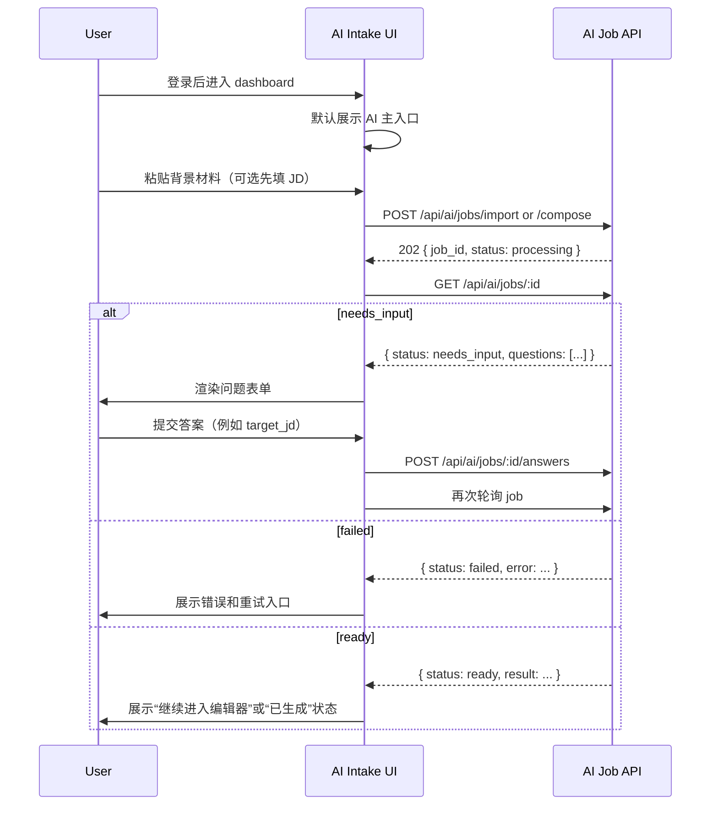

## 0. 术语约定

| 术语 | 定义 | 防冲突结论 |
|---|---|---|
| AI 主入口 | 登录后默认看到的第一条产品路径：输入背景材料、补充 JD、启动 AI job | 与 roadmap 第 2 节“AI intake 成为 Web 产品主入口”一致 |
| Intake form | 本 feature 中用户提交背景材料和可选 JD 的表单，不等同于 editor | 新概念；与现有 editor 表单区分 |
| Secondary manual entry | 旧的 editor 入口，被降级为次要 fallback，不再作为 dashboard 主按钮 | 名称来源 roadmap update；避免继续叫“新建简历”造成主入口误导 |
| Job status panel | 展示 `processing / needs_input / failed / ready` 的只读状态区 | 依赖 `ai-job-api` 返回结构，不与 editor 状态混淆 |
| Clarification answer form | 对 `needs_input` job 渲染的结构化 answers 提交表单；本 feature 只支持最小通路，不负责问题生成规则 | 与后续 `ai-clarification-loop` feature 边界明确 |

已对 `new-resume-btn`、`dashboard`、`editor`、`ai job`、`needs_input` 做 grep；当前代码里 dashboard 仍以旧“新建简历”按钮作为主入口，没有 AI intake UI。

## 1. 决策与约束

### 需求摘要

- **做什么**：把登录后的 dashboard 主入口从“新建空白简历”改成 AI intake 页面，用户通过粘贴背景材料、补充可选 JD、查看 AI job 状态并提交结构化 answers 来驱动 `ai-job-api`。
- **为谁**：通过 Web 使用产品的终端用户；尤其是“我有原始材料和目标岗位，不想先手填表单”的用户。
- **成功标准**：
  - 登录后首先看到 AI intake 主入口，而不是旧的 `+ 新建简历` 主按钮
  - 用户可输入背景材料，提交到 `POST /api/ai/jobs/import` 或 `POST /api/ai/jobs/compose`
  - job 进入 `needs_input` 时，页面能显示问题并提交 answers
  - 页面能展示 `processing / needs_input / failed / ready` 四种状态
  - editor 入口仍存在，但降级为 secondary fallback，不再作为默认起点
- **明确不做**：
  - 不在本 feature 内兑现真正的文件上传解析（归 `ai-document-intake`）
  - 不在本 feature 内把 AI 结果自动落成 draft resume（归 `ai-result-apply`）
  - 不新增对话式富聊天体验、消息气泡历史或多轮复杂引导（归后续 `ai-clarification-loop`）
  - 不修复或继续增强旧的“空白新建简历 -> 手填”主路径，只把它降级出主入口

### 复杂度档位

- `结构 = modules`（偏离默认 functions 的原因：会同时改 `index.html`、`app.js`、`style.css`，并引入新的 AI UI 状态与 API 调用逻辑）
- `可测试性 = tested`（偏离默认 testable 的原因：主入口切换是用户第一印象，至少要有真实浏览器或可重复行为证据）

其余维度走“项目内部工具”默认组合，无偏离。

### 关键决策

1. **主入口先做“表单式 AI intake”，不直接做聊天 UI。**
   - 动机：`ai-job-api` 已经提供背景优先 / JD 第二 / answers 提交的 API 语义，用一个轻量表单和状态面板即可走通主路径；直接做完整聊天式界面会把本 feature 和 `ai-clarification-loop` 缠在一起。
   - 被拒方案：一步到位做完整对话式聊天页 → 超出当前依赖条件，且会把 UI 与问题生成策略耦死。

2. **旧 editor 入口保留但降级，不再默认显眼暴露。**
   - 动机：roadmap 已明确 editor 是 fallback；完全删掉会影响后续 `ai-result-apply` 和人工修订路径。
   - 落地方式：dashboard 主 CTA 改为 AI intake；手动编辑入口移到次级位置，例如小按钮或说明区。

3. **本 feature 的主通路先支持“文本背景 + 可选 JD”，文件上传控件不作为已实现能力承诺。**
   - 动机：`ai-document-intake` 还没做，当前 `ai-job-api` 的对外入口是 JSON，不是 multipart；如果在这条 feature 假装支持文件上传，会制造假入口。
   - 落地方式：
     - 主通路：textarea 输入背景材料 + 可选 JD
     - 文件上传：要么不出现，要么明确标记“即将支持”；本 design 倾向不出现，避免误导

4. **`needs_input` 的最小 answers 提交通路在本 feature 内落地。**
   - 动机：如果 UI 不能提交 `target_jd` 这类问题，主入口会卡在第一轮 `needs_input`。这不算越界到 `ai-clarification-loop`，因为这里只做通用问答表单，不做复杂问题策略。

### 前置依赖

- `ai-job-api` 已完成并提供：`/api/ai/jobs/import`、`/api/ai/jobs/compose`、`GET /api/ai/jobs/:job_id`、`POST /api/ai/jobs/:job_id/answers`
- 当前前端现状：`src/web/static/index.html` 的 dashboard 只有 `resume-list + new-resume-btn`；`app.js` 以 editor/CRUD 为主，没有 AI job UI 状态

## 2. 名词与编排

### 2.1 名词层

#### 现状

- `src/web/static/index.html` 当前只有 `view-login`、`view-register`、`view-dashboard`、`view-editor` 四个视图。
- `view-dashboard` 当前由 `#resume-list` 和 `#new-resume-btn` 构成，AI 主入口不存在。
- `src/web/static/app.js` 当前的 dashboard 编排是：登录成功 -> `showDashboard()` -> `loadResumeList()` -> 用户点击 `handleNewResume()` 进入 editor。
- 旧主入口 `handleNewResume()` 当前还会触发一个已知坏路径：创建空白简历被后端拒绝。

#### 变化

新增 4 组名词：

| 名词 | 动作 | 变化 |
|---|---|---|
| `AI intake panel` | 新增 | dashboard 第一屏里的主入口区块，承载背景材料输入、JD 输入、job 状态展示 |
| `AiIntakeDraft` | 新增 | 前端本地状态对象，保存背景文本、JD、target role、当前 job id |
| `JobStatusPanel` | 新增 | 展示 job 当前状态、错误、questions、继续动作 |
| `Secondary manual entry` | 新增 | 仍可进入 editor 的次级入口文案/按钮 |

修改 3 处现有名词：

| 名词 | 动作 | 变化 |
|---|---|---|
| `view-dashboard` | 修改 | 从“简历列表 + 新建按钮”改成“AI 主入口 + 历史 resume 列表 + 次级手动入口” |
| `#new-resume-btn` | 修改 | 保留但降级为 secondary manual entry，文案改成“手动创建草稿（备用）” |
| `app.js` / `ai-intake.js` dashboard 状态 | 修改 | 从 CRUD-first 切换为 AI-intake-first，并把 AI 逻辑拆到新文件 |

#### 接口示例

**启动 AI import job**

```json
// 来源：src/web/static/ai-intake.js handleStart
POST /api/ai/jobs/import
Request:
{
  "text": "我有 6 年后端经验，做过 Go、Kafka、支付系统...",
  "jd_text": "Senior Backend Engineer ..."
}

Response:
{ "job_id": "job_123", "status": "processing" }
```

**读取 needs_input job**

```json
// 来源：src/web/static/ai-intake.js startPolling
GET /api/ai/jobs/job_123
Response:
{
  "id": "job_123",
  "status": "needs_input",
  "questions": [
    {
      "key": "target_jd",
      "question": "请提供目标岗位 JD 或至少职位摘要、必备技能和职责。",
      "required": true
    }
  ]
}
```

**提交 answers**

```json
// 来源：src/web/static/ai-intake.js submitAnswers
POST /api/ai/jobs/job_123/answers
Request:
{
  "answers": [
    { "key": "target_jd", "value": "Senior Backend Engineer ..." }
  ]
}
```

### 2.2 编排层

#### 主流程图



#### 现状

- 当前登录后流程直接进入 dashboard，并把用户引导到 `new-resume-btn` 或简历列表点击编辑。
- dashboard 的行为核心是 resume CRUD，不是 AI intake。
- 当前前端没有任何 AI job 轮询、questions 渲染、answers 提交逻辑。

#### 变化

1. **登录后默认心理模型变化**：从“我要新建一个空白简历”改成“我先给材料，让 AI 帮我起草”。
2. **dashboard 编排变化**：
   - 第一屏先展示 AI intake form
   - 其后才是历史 resume 列表
   - editor 入口降为 secondary fallback
3. **前端状态变化**：新增 AI job 本地状态机：
   - idle
   - submitting
   - polling
   - needs_input
   - failed
   - ready

#### 流程级约束

- **错误语义**：
  - 创建 job 失败 -> 顶部错误消息 + 保留已填写背景材料
  - job `failed` -> 在 status panel 里展示后端 error，不自动清空表单
  - answers 提交失败 -> 保留已填 answers
- **顺序约束**：
  - 不能再把 `handleNewResume()` 当默认下一步
  - job 进入 `needs_input` 时，只渲染服务端给出的 questions，不在前端私自补问
- **可观测点**：
  - UI 上明确显示当前 job status
  - job 轮询中的 loading 状态要可见
  - `ready` 状态先不自动跳 editor（归后续 feature 决定），但要留出结果进入点

### 2.3 挂载点清单

| 挂载位置 | 具体位置 | 动作 |
|---|---|---|
| Dashboard 主 CTA | `src/web/static/index.html` + `app.js` | 修改 — 主入口从 `new-resume-btn` 切到 dashboard 第一屏的 AI intake panel |
| AI 视图状态 | `src/web/static/ai-intake.js` | 新增 — AI intake 本地状态、轮询、answers 提交编排 |
| AI job API 调用点 | `src/web/static/app.js` / `spa-utils.js` | 新增 — 调用 `/api/ai/jobs/*` |
| Secondary manual entry | `src/web/static/index.html` + `app.js` | 新增/修改 — editor fallback 入口，非主 CTA，仍可创建手动草稿并进入 editor |

### 2.4 推进策略

1. **静态结构**：重做 dashboard 结构，把 AI intake form 放到第一屏，旧 `new-resume-btn` 降级或隐藏
   - 退出信号：登录后肉眼看到 AI 主入口而不是旧新建按钮
2. **AI job 提交骨架**：前端可提交背景材料 / 可选 JD 到 `ai-job-api`
   - 退出信号：点击提交后能创建 job，UI 进入 polling
3. **状态展示**：渲染 `processing / needs_input / failed / ready` 四态
   - 退出信号：mock 或真实 job 状态变化时，界面展示稳定且不会跳错视图
4. **answers 提交通路**：渲染 `questions[]` 并提交 answers
   - 退出信号：`target_jd` 缺失时，用户可以在 UI 内补完并继续 job
5. **fallback 收尾**：保留历史 resume 列表和 secondary editor 入口，不再鼓励走旧空白新建路径
   - 退出信号：历史 resume 仍可访问，但默认视觉焦点已切换到 AI 主入口

### 2.5 结构健康度与微重构

#### 评估

- **文件级** — `src/web/static/index.html`
  - 行数：119 行，当前结构还算紧凑
  - 职责：login/register/dashboard/editor 多视图容器，继续新增 AI intake 区块仍可承载
- **文件级** — `src/web/static/app.js`
  - 行数：约 448 行，已经偏长且承担 auth、dashboard、editor、pdf 生成多种行为
  - 改动密度：本 feature 还要继续加 AI intake 状态和轮询，很容易把它推成“什么都管”的文件
- **目录级** — `src/web/static/`
  - 现状：只有 `index.html`, `app.js`, `style.css`, `spa-utils.js`
  - 本次新增：如果继续把 AI intake 行为堆进 `app.js`，目录文件数不多但文件职责会失衡

#### 结论：微重构（拆文件）

在实现本 feature 前，先把 `app.js` 里的 AI intake 逻辑拆到新文件，避免继续把 dashboard / editor / auth / pdf / AI 全堆在一个文件里。

#### 方案
- 搬什么：AI intake 提交、轮询、status panel、answers 提交相关逻辑
- 搬到哪：`src/web/static/ai-intake.js`
- 行为不变怎么验证：现有登录 / dashboard / editor / pdf 相关行为不变；拆分后页面加载正常；对外 DOM id 和现有 view 切换不变
- 步骤序列（provable refactor）：
  1. 新建 `ai-intake.js`，只承载 AI intake 相关函数
  2. `app.js` 保留初始化和视图主编排，通过全局函数或模块边界调用 `ai-intake.js`
  3. 验证登录、resume list、editor、pdf panel 行为无回归

#### 超出范围的观察
- `src/web/static/index.html` 和 `app.js` 长期看会继续膨胀；如果后续再加聊天 UI 或更复杂 editor，可能要单独走前端结构拆分，不在本 feature 顺手做

## 3. 验收契约

### 关键场景清单

| # | 场景 | 触发 | 期望可观察结果 |
|---|---|---|---|
| 1 | 登录后首页 | 用户登录成功 | 第一屏先看到 AI intake 区块，而不是旧的 `+ 新建简历` 主按钮 |
| 2 | 提交背景材料 | 用户输入背景材料并点击开始 | 创建 AI job，页面进入 `processing` / 轮询状态 |
| 3 | 缺少 JD | 后端返回 `needs_input` + `target_jd` 问题 | 页面显示问题表单，允许用户继续填写 JD |
| 4 | 提交 answers | 用户填写 `target_jd` 并提交 | 页面重新进入 `processing`，不再停留在旧问题上 |
| 5 | sidecar 失败 | job 状态为 `failed` | 页面展示明确错误，不清空已输入背景材料 |
| 6 | 历史 resume 保留 | dashboard 中已有 resumes | 历史列表仍可见，点击仍可进入 editor |
| 7 | fallback 入口保留 | 用户想手动编辑 | 仍能找到 secondary manual entry，但视觉上不再是主 CTA |

### 明确不做的反向核对

- 本 feature 不应让文件上传看起来“已经可用”但实际走不通
- 本 feature 不应自动把 `ready` job 跳进 editor 并创建 draft resume
- 本 feature 不应继续把旧 `new-resume-btn` 当首页最显眼按钮

## 4. 与项目级架构文档的关系

### 需提炼回 architecture 的内容

- **名词**：AI 主入口、secondary manual entry、job status panel
- **动词骨架**：登录后先走 AI intake，再通过 `ai-job-api` 驱动 job 状态，editor 只是 fallback
- **流程级约束**：前端问题渲染必须以后端 `questions[]` 为准，不私自发明问题顺序

### 对现有架构文档的影响

- acceptance 阶段需要把 Web 服务 / 前端模块从“resume CRUD + editor first”更新为“AI intake first + editor fallback”
- 若本 feature 落地，之前 dashboard 的“新建简历”默认路径将正式退出主产品入口
