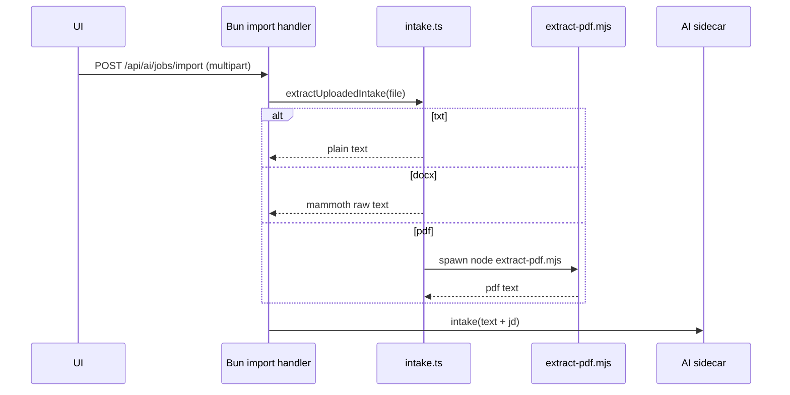

## 0. 术语约定

| 术语 | 定义 | 防冲突结论 |
|---|---|---|
| Uploaded intake | 上传文件提取后的统一中间态，只包含 `text`、`sourceType`、`fileName`，不承担重规则解析职责 | 与 roadmap 第 3 节 Document Intake Layer 一致 |
| Text extraction | 仅把文件变成文本，不负责把它拆成结构化背景档案 | 明确区别于 `ai-resume-structuring` |
| Import job | 前端通过 `/api/ai/jobs/import` 创建的 AI 任务，可来自文件上传或纯文本 | 复用 `ai-job-api` 已有术语 |

## 1. 决策与约束

### 需求摘要
- **做什么**：支持 `.txt`、`.docx`、`.pdf` 上传，把文件提取成文本后交给现有 AI job 主链路。
- **为谁**：不想手填背景材料、直接拿旧简历文件起稿的用户。
- **成功标准**：
  - `POST /api/ai/jobs/import` 支持 `multipart/form-data`
  - `.txt`、`.docx`、`.pdf` 都能提取文本
  - 上传文件 + JD 能直接进入 AI 草稿 -> editor -> PDF 主链路
- **明确不做**：
  - 不在 Bun 里堆重规则解析器
  - 不把文件内容先单独拆成结构化 background profile 再交给 AI
  - 不支持图片 OCR 或扫描件识别

### 关键决策
1. 只做**文本提取**，不做重结构化解析。
2. `pdf` 提取走 Node 子进程，避免 Bun 直接吃 `pdf-parse` 的兼容性问题。
3. 提取结果直接进入 AI sidecar，由 AI 负责理解和直出草稿。

## 2. 名词与编排

### 2.1 名词层

#### 现状
- `ai-job-api` 已能处理文本 background + JD
- 前端 `ai-chat-intake-ui` 已有文件选择控件和 AI 主入口

#### 变化
- 新增 `src/web/ai/intake.ts`
- 新增 `src/web/ai/extract-pdf.mjs`
- `src/web/ai/handlers.ts` 的 `/api/ai/jobs/import` 支持 multipart 上传

#### 接口示例

```text
POST /api/ai/jobs/import
Headers: Authorization: Bearer <token>
Body: multipart/form-data
Fields:
  file = 黄泽林简历.pdf
  jd_text = Senior Backend Engineer, Go, Kafka, distributed systems

Response: 202 { job_id, status: "processing" }
```

### 2.2 编排层



#### 流程级约束
- 上传文件优先，文本框只是 fallback
- PDF 提取失败要返回 `invalid_input`
- 文本提取结果直接交给 AI，不在 Bun 里做重解析

### 2.3 挂载点清单
- `src/web/ai/intake.ts`：新增文件提取入口
- `src/web/ai/extract-pdf.mjs`：新增 PDF 文本提取子进程脚本
- `src/web/ai/handlers.ts`：`/api/ai/jobs/import` 新增 multipart 分支
- `src/web/static/ai-intake.js`：上传文件调用点

### 2.4 推进策略
1. 文本提取骨架
2. PDF 提取子进程接通
3. multipart import 接入
4. 浏览器主流程验证

### 2.5 结构健康度与微重构
结论：不做微重构。`src/web/ai/` 已是合适归属，新增文件边界清楚。

## 3. 验收契约
- 上传 txt -> AI 主链路可走通
- 上传 docx -> 能提取文本进入 AI 主链路
- 上传真实 PDF -> 能提取文本进入 AI 主链路，并最终进 editor
- 上传 + JD -> 能最终生成 PDF 并浏览器下载

## 4. 与项目级架构文档的关系
- 需回写：Document Intake Layer 只做文件到文本的最小提取，不做重解析；PDF 提取走 Node 子进程
