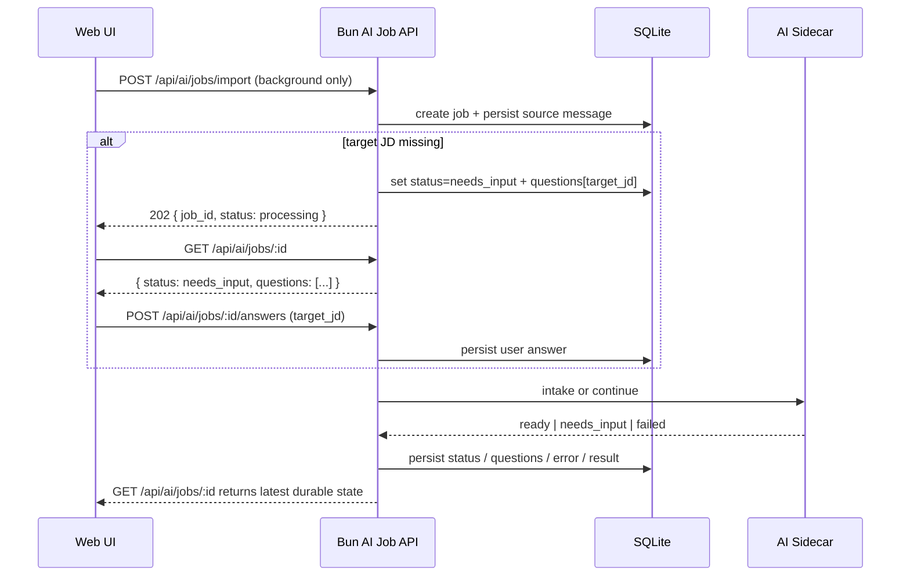

## 0. 术语约定

| 术语 | 定义 | 防冲突结论 |
|---|---|---|
| AI job | Bun 主服务里一条持久化的 AI 任务记录，负责承载状态、问题、结果和所有权 | 名称来源 roadmap 第 4.2 / 4.5 节；当前代码无同名实体 |
| Candidate background | 候选人的原始经历材料，优先于 JD 收集；可来自文本、文件、现有 resume id | 名称来源 `agent-resume` skill 和 `intake-and-tailoring.md` |
| Target JD | 目标岗位的 job description，必须在背景之后收集，用于定制化 | 名称来源 `agent-resume` skill 和 `intake-and-tailoring.md` |
| Clarification question | AI 或 Bun 状态机要求用户补充的一条结构化问题；第一个典型问题就是 `target_jd` | 与 roadmap 第 4.2 节 `questions[]` 一致 |
| Job state machine | `processing | needs_input | ready | failed` 四态机，Bun 侧是唯一真相源 | 名称来源 roadmap 第 4.2 / 4.5 节 |

已对 `ai_jobs`、`questions`、`target_jd`、`createAiClient`、`agent-resume` 做 grep；当前代码里没有现成 job 状态机实现，也没有与这套术语冲突的已有命名。

## 1. 决策与约束

### 需求摘要

- **做什么**：在 Bun 主服务新增 AI job API 和持久化状态机，让 Web 主入口可以按“先背景、再 JD、再继续生成”的节奏驱动 AI sidecar，而不是直接暴露零散的 sidecar internal API。
- **为谁**：后续 `ai-chat-intake-ui`、`ai-document-intake`、`ai-result-apply` 的实现者，以及最终通过 Web 走 AI 主入口的用户。
- **成功标准**：
  - 新增对外 API：创建 job、查询 job、提交 answers
  - Bun 持久化 `ai_jobs` 和 `ai_job_messages`
  - 当用户只提交候选人背景时，job 会进入 `needs_input` 并明确要求 `target_jd`
  - 当用户补完 `target_jd` 后，Bun 可调用 sidecar 并保存 sidecar 的结构化失败/成功结果
  - job ownership、权限控制、错误语义对齐现有 auth / resume API 风格
- **明确不做**：
  - 不做浏览器 UI（归 `ai-chat-intake-ui`）
  - 不做真正的文档抽取/解析（归 `ai-document-intake`）
  - 不做真实 ResumeDocument 结构化逻辑（归 `ai-resume-structuring`）
  - 不在本 feature 自动创建 draft resume（归 `ai-result-apply`）
  - 不修改旧的 `/api/resumes/import` 逻辑，只把它从产品主路径排除

### 复杂度档位

- `健壮性 = L3`（偏离默认 L2 的原因：这是用户可见的对外 API，包含鉴权、状态机和跨进程调用，错误语义必须稳定）
- `可观测性 = logged`（偏离默认 opaque 的原因：AI job 进入 `needs_input`、`failed` 或 sidecar 不可达时，必须能在日志里追踪）
- `可测试性 = tested`（偏离默认 testable 的原因：这条 feature 是后续多个 AI feature 的共同地基，至少要覆盖状态机核心路径）

其余维度走“对外发布的库/服务”默认组合，无偏离。

### 关键决策

1. **AI job API 按原始 skill 流程建模：背景优先，JD 第二。**
   - 依据：仓库自带 `agent-resume` skill 明确要求 `Collect candidate background first`，`Collect the target JD second`。
   - 落地方式：
     - `POST /api/ai/jobs/import` 或 `POST /api/ai/jobs/compose` 接收背景材料
     - 若请求里没有 JD，则 job 进入 `needs_input`，生成 `target_jd` 问题
     - `POST /api/ai/jobs/:job_id/answers` 先承载 JD，再承载后续缺失项
   - 被拒方案：直接把 `jd_text` 作为所有入口的必填字段 → 违背原技能的提问顺序

2. **Bun 是 job state 的唯一真相源，sidecar 不持久化 job。**
   - 动机：roadmap 第 4.5 节已定，且 Bun 已有用户体系、resume 持久化和 auth 约束。
   - 结果：sidecar 只返回结构化结果；job status、questions、messages、error 都回存在 Bun。

3. **本 feature 允许 sidecar 仍是 stub，但 Bun 侧状态机必须真实工作。**
   - 动机：`eino-service-scaffold` 当前只返回 `not_implemented`，但 `ai-job-api` 不能因此退化成空壳；它至少要能表达“先收背景、再要 JD、再调 sidecar”的编排规则。
   - 结果：
     - 未提供 JD 时，Bun 不调用 sidecar，直接进入 `needs_input`
     - 已提供 JD 后，Bun 调 sidecar；即使 sidecar 只回 `failed/not_implemented`，job 状态机也成立

4. **AI job API 先保持对外简单，不暴露多阶段专用 endpoint。**
   - 动机：roadmap 第 4.2 节已经约束了 `/import`、`/compose`、`GET /:job_id`、`POST /:job_id/answers` 四组接口；不要在本 design 里偷改成另一套 API 面。
   - 结果：阶段信息通过 `status + questions[]` 暴露，不额外新增 `submit-jd` / `submit-background` 等 endpoint。

### 前置依赖

- `ai-resume-agent` roadmap 中 `eino-service-scaffold` 已 `done`
- 现有 `src/web/ai/client.ts` 已提供 Bun -> sidecar 的 typed internal client
- 当前仓库尚无 AI job 表、无对外 `/api/ai/jobs/*`、无 AI job message 持久化

## 2. 名词与编排

### 2.1 名词层

#### 现状

- `src/web/db/schema.ts` 当前只有 `users`、`resumes` 两张表，没有 AI job 表或消息表。
- `src/web/server.ts` 当前只分发 auth、legacy import、pdf、resume、static 路由，没有 `/api/ai/jobs/*`。
- `src/web/ai/client.ts` 已能调 sidecar 的 `/internal/ai/intake` 与 `/internal/ai/continue`，但还没有任何主服务调用方。
- `agent-resume` skill 和 `intake-and-tailoring.md` 已经给出了“背景先收、JD 第二”的交互顺序，但现有 Web 代码没有这层状态机。

#### 变化

新增 4 组名词：

| 名词 | 动作 | 变化 |
|---|---|---|
| `AiJobRow` | 新增 | 对应 `ai_jobs` 表，记录 job kind、status、source_type、source_ref、questions、warnings、error、result_resume_id |
| `AiJobMessageRow` | 新增 | 对应 `ai_job_messages` 表，记录 job 的 system / assistant / user 交互轨迹 |
| `AiJobQuestion` | 新增 | Bun 暴露给前端的一条结构化问题，至少包含 `key`, `question`, `required` |
| `AiJobHandlers` | 新增 | Bun 对外 AI job API 的 handler 集合 |

修改 2 处现有名词：

| 名词 | 动作 | 变化 |
|---|---|---|
| `src/web/db/schema.ts` | 修改 | 从“users + resumes”扩展为“users + resumes + ai_jobs + ai_job_messages” |
| `src/web/server.ts` | 修改 | 新增 AI job route 分发分支 |

#### 接口示例

**创建 import job（只有背景，无 JD）**

```json
// 来源：src/web/ai/handlers.ts createImportJob
POST /api/ai/jobs/import
Request:
{
  "text": "我有 6 年后端经验，做过 Go、Kafka、支付系统..."
}

Immediate Response:
{ "job_id": "job_123", "status": "processing" }

Then GET /api/ai/jobs/job_123:
{
  "id": "job_123",
  "status": "needs_input",
  "questions": [
    {
      "key": "target_jd",
      "question": "请提供目标岗位 JD 或至少职位摘要、必备技能和职责。",
      "required": true
    }
  ]
}
```

**提交 JD answers**

```json
// 来源：src/web/ai/handlers.ts answerJob
POST /api/ai/jobs/job_123/answers
Request:
{
  "answers": [
    {
      "key": "target_jd",
      "value": "Senior Backend Engineer ..."
    }
  ]
}

Response:
{ "job_id": "job_123", "status": "processing" }
```

**查询失败中的 stub job**

```json
// 来源：src/web/ai/handlers.ts getJob
GET /api/ai/jobs/job_123
Response:
{
  "id": "job_123",
  "status": "failed",
  "error": {
    "code": "not_implemented",
    "message": "AI workflow scaffold is running but intake logic is not implemented yet"
  }
}
```

### 2.2 编排层

#### 主流程图



#### 现状

- 当前编排只有“主服务直接处理 Web CRUD / PDF / legacy import”；没有一条用户可见的 AI task flow。
- 当前 sidecar 只是 stub，主服务没有 job ownership、没有 AI message log、没有“缺 JD 则先追问”的逻辑。

#### 变化

1. **新增 Bun 侧 AI job 状态机**：
   - create job
   - persist source/background
   - if JD missing -> `needs_input`
   - if JD present -> call sidecar
   - persist sidecar result
2. **新增持久化消息轨迹**：背景材料、JD 回答、系统生成的问题都要入 `ai_job_messages`
3. **新增查询语义**：前端不再直接猜“现在该干嘛”，而是轮询/读取 `GET /api/ai/jobs/:id` 的 `status + questions + error + result`

#### 流程级约束

- **错误语义**：
  - 鉴权失败 -> 401
  - 非 owner -> 403
  - job 不存在 -> 404
  - payload 非法 -> 400 `invalid_input`
  - state 非法（如对 `ready` job 再提交 answers）-> 409 `invalid_state`
  - sidecar 调用失败但 job 已存在 -> job 进入 `failed`，不是直接让 HTTP 请求崩掉
- **幂等性**：
  - `GET /api/ai/jobs/:id` 幂等
  - `POST /answers` 非幂等；同一回答重复提交会追加消息并重新推进
- **顺序约束**：
  - 没有 JD 时，不允许直接调用 sidecar 的真正 intake/compose 路径
  - 只有在 `needs_input` 且问题存在时才能接收 `answers`
- **可观测点**：
  - job status 迁移日志
  - sidecar 调用开始/结束日志
  - sidecar 错误码与 HTTP 请求 id 关联

### 2.3 挂载点清单

| 挂载位置 | 具体位置 | 动作 |
|---|---|---|
| HTTP 路由表 | `src/web/server.ts` | 新增 — `/api/ai/jobs/import`、`/api/ai/jobs/compose`、`/api/ai/jobs/:job_id`、`/api/ai/jobs/:job_id/answers` |
| 数据库 schema | `src/web/db/schema.ts` | 新增 — `ai_jobs`、`ai_job_messages` 两张表与配套 CRUD helper |
| Bun 内部 AI client 使用点 | `src/web/ai/handlers.ts` 或同模块服务函数 | 新增 — 调用 `createAiClient()` 的首个真实消费方 |
| 认证边界 | 现有 JWT Bearer 校验链路 | 新增 — AI job API 纳入现有登录态和 owner 鉴权 |

### 2.4 推进策略

1. **持久化骨架**：补齐 `ai_jobs` / `ai_job_messages` 表结构和基础 CRUD
   - 退出信号：主服务可创建 / 查询一条 AI job，不接 sidecar 也能持久化状态
2. **对外 API 骨架**：挂上 import / compose / get / answers 四组路由和认证校验
   - 退出信号：鉴权、404、403、400 等基础 HTTP 语义稳定
3. **背景优先 / JD 第二状态机**：实现“无 JD 则 needs_input + 生成 target_jd 问题”的 Bun 侧编排
   - 退出信号：仅提交背景材料时，GET job 返回 `needs_input` + `target_jd` 问题
4. **sidecar 集成**：当 JD 已具备时，调用 `createAiClient()` 并持久化 sidecar 结果
   - 退出信号：stub sidecar 返回 `failed/not_implemented` 时，job 查询结果也稳定反映该状态
5. **消息轨迹与测试覆盖**：把 source / JD / answers / assistant questions 入库，并补齐状态机核心路径测试
   - 退出信号：关键场景都有自动化或可重复证据

### 2.5 结构健康度与微重构

#### 评估

- **文件级** — `src/web/db/schema.ts`
  - 行数：92 行，当前集中管理 SQLite schema 与 CRUD helper，仍在可控范围
  - 职责：users + resumes 两类实体，新增 ai_jobs / ai_job_messages 后仍属于同一数据库边界
  - 改动密度：本 feature 会新增 2 张表和一组 helper，但不必先拆层
- **文件级** — `src/web/server.ts`
  - 行数：170 行，已承担多路由分发
  - 职责：单文件继续堆 handler dispatch 有变胖趋势，但本 feature 只新增一个 `handleAiJobRoute()` 分支仍可接受
  - 超出范围信号：若后续再加更多 AI route / SSE / upload 细分，应考虑后续单独做 route 拆分
- **目录级** — `src/web/`
  - 现状：已按 `auth/`, `db/`, `pdf/`, `resume/`, `import/`, `ai/`, `static/` 分目录
  - 本次新增：继续在 `src/web/ai/` 下落 handler / type / helper，符合现有模块归属

#### 结论：不做微重构

当前文件和目录都还能承载这条 feature；关键是把 AI job 逻辑集中落在 `src/web/ai/`，不要把状态机散落到 `server.ts` 和 legacy import 逻辑里。

#### 超出范围的观察

- `src/web/server.ts` 路由分发继续增长，未来若 AI 主入口继续扩张，应单独走 route dispatch 拆分，不在本 feature 内顺手做

## 3. 验收契约

### 关键场景清单

| # | 场景 | 触发 | 期望可观察结果 |
|---|---|---|---|
| 1 | 创建 import job（仅背景） | `POST /api/ai/jobs/import`，只给 `text` 或 `file`，不给 JD | 返回 202；随后 `GET job` 显示 `needs_input`，且 `questions[0].key = target_jd` |
| 2 | 创建 compose job（背景 + JD 都齐） | `POST /api/ai/jobs/compose`，同时给原始材料和 JD | 返回 202；随后 `GET job` 显示 sidecar 返回的持久化状态（当前阶段应为 `failed/not_implemented`） |
| 3 | 提交 JD answer | 对 `needs_input` job 调 `POST /answers`，提交 `target_jd` | 返回 202；随后 job 不再停留在旧的 JD 缺失问题上 |
| 4 | 非法状态提交 answers | 对 `failed` / `ready` job 再提交 `answers` | 返回 409 `invalid_state` |
| 5 | 所有权隔离 | 用户 A 访问用户 B 的 job | 返回 403 |
| 6 | 不存在 job | `GET /api/ai/jobs/:id` 不存在 | 返回 404 |
| 7 | sidecar 不可达 | Bun 调 sidecar 报网络错误 | job 进入 `failed`，错误被持久化，HTTP 创建请求不应直接把整个服务打崩 |

### 明确不做的反向核对

- 本 feature 不应新增浏览器 UI 文件或改 dashboard 主页面结构
- 本 feature 不应创建 draft resume，也不应写 `resumes` 表新记录
- 本 feature 不应把 `/api/resumes/import` 改造成 AI 主入口
- 本 feature 不应实现真实简历结构化、JD match 或 prompt 编排逻辑

## 4. 与项目级架构文档的关系

### 需提炼回 architecture 的内容

- **名词**：`ai_jobs` / `ai_job_messages` 作为新的持久化实体
- **动词骨架**：Bun 主服务先持久化背景，再追问 JD，再调用 sidecar，而不是直接把用户请求透传给 sidecar
- **流程级约束**：
  - Bun 是 AI job 状态机的唯一真相源
  - sidecar 失败要转成 durable job state，而不是瞬时 HTTP 异常
  - editor 仍不在本 feature 范围内，结果落 draft 由后续 feature 负责

### 对现有架构文档的影响

- acceptance 阶段需要把 Web 服务模块从“CRUD/PDF”扩展为“CRUD/PDF/AI job orchestration”
- 如果这条 feature 落地，会进一步坐实“Bun Product Surface + AI sidecar”双 runtime 架构，而不是只停留在 scaffold 阶段
