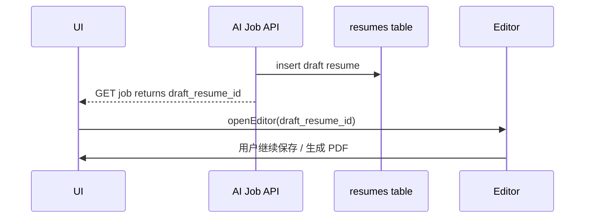

## 0. 术语约定

| 术语 | 定义 | 防冲突结论 |
|---|---|---|
| Draft resume | AI 生成并落库的初稿 resume，供用户进入 editor 修订 | 与 `resumes` 表一致 |
| Result apply | 把 AI sidecar 的 `ready + resume_document` 结果写入 `resumes`，并把 `draft_resume_id` 回传给前端 | 对应 roadmap item |
| Editor jump | 前端在 job `ready` 且拿到 `draft_resume_id` 时自动进入 `view-editor` | 与旧 CRUD 入口区分 |

## 1. 决策与约束

### 需求摘要
- **做什么**：AI sidecar 返回 `ready` 时，Bun 自动创建 draft resume，前端轮询到 `draft_resume_id` 后自动进 editor，并继续走现有 PDF 流程。
- **为谁**：上传旧简历 + JD 后不想停在“ready 状态文本提示”，而是希望直接进草稿编辑的用户。
- **成功标准**：
  - `ready + resume_document` 会落库到 `resumes`
  - `GET /api/ai/jobs/:id` 返回 `result.draft_resume_id`
  - 前端轮询到 `draft_resume_id` 后自动打开 editor
  - editor 内继续点生成 PDF 可走通
- **明确不做**：
  - 不在本 feature 内增强 AI 质量
  - 不新增新的编辑器 schema
  - 不改变现有 PDF 内核，只复用

### 关键决策
1. Draft resume 继续复用现有 `resumes` 表，而不是新增单独草稿表。
2. `result_resume_id` / `draft_resume_id` 是前后端衔接 editor 的唯一主键。
3. 前端自动跳 editor，不要求用户额外点“打开草稿”。

## 2. 名词与编排

### 2.1 名词层

#### 现状
- `ai-job-api` 已有 `result_resume_id` 字段位
- 前端 `ai-intake.js` 已会轮询 job 状态
- editor 与 PDF 流程原本就存在

#### 变化
- `src/web/ai/handlers.ts`：新增 `createDraftResume()`，在 `ready` 时落草稿
- `src/web/ai/handlers.ts`：`toJobResponse()` 回传 `draft_resume_id`
- `src/web/static/ai-intake.js`：在 `ready` 时自动 `openEditor(draft_resume_id)`

### 2.2 编排层

#### 流程级约束
- 只有 `ready + resume_document` 才允许创建 draft
- 草稿创建必须先经过 `normalizeResumeDocument()`
- editor jump 只在首次拿到新 `draft_resume_id` 时发生一次，避免死循环

### 2.3 挂载点清单
- `src/web/ai/handlers.ts`：ready 结果落草稿
- `src/web/static/ai-intake.js`：轮询 ready 时自动跳 editor
- `src/web/static/app.js`：暴露 `openEditor` 供 AI intake 调用

### 2.4 推进策略
1. Bun 侧 ready 结果落草稿
2. job 查询返回 `draft_resume_id`
3. 前端 ready 时自动跳 editor
4. editor 内继续生成 PDF 验证

### 2.5 结构健康度与微重构
结论：不做微重构。逻辑落点已集中在 `src/web/ai/handlers.ts` 和 `src/web/static/ai-intake.js`。

## 3. 验收契约
- AI 结果为 ready 时能创建 draft resume
- 前端自动进入 editor
- editor 里继续生成 PDF 成功

## 4. 与项目级架构文档的关系
- 需回写：AI 主链路不止到 job ready，而是继续延伸到 draft resume、editor、PDF
